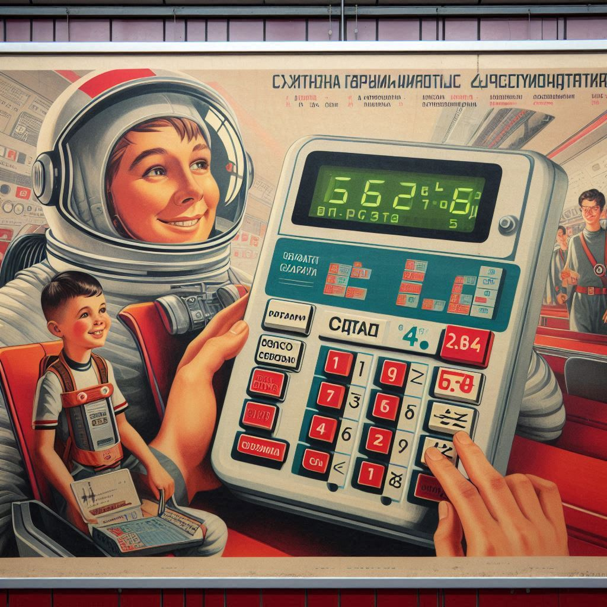

# Creative Brief: The People's Calculator

## 1. Brand Overview

**Company/Organization Name:** StarCount

**Industry/Sector:** EdTech

**Mission Statement:** To make STEM education accessible and exciting for all Americans through innovative, space-themed learning tools.

**Brand History:** Founded in 2023 by a diverse group of educators and tech entrepreneurs who wanted to reignite America's passion for space exploration and STEM education.

**Core Values:** Accessibility, Empowerment, Exploration

**Target Audience:** American students aged 8-16, their parents, and educators looking for engaging STEM learning tools.

## 2. Brand Identity

**Brand Essence:** Cosmic Empowerment

**Key Attributes to Communicate:** User-friendly, Cutting-edge technology, Educational, Inspirational

**Emotional Response to Evoke:** Curiosity, Excitement, Confidence

**Visual Style Direction:** Modern, sleek design with cosmic elements and vibrant, patriotic color scheme

**Brand Voice and Tone:** Enthusiastic, encouraging, and easy to understand

**Brand Personality:** Adventurous, knowledgeable, and supportive mentor

## 3. Product/Service Information

**Main Offerings:** The People's Calculator (advanced educational calculator), StarCount mobile app, Online STEM learning platform

**Unique Selling Proposition (USP):** The only STEM learning ecosystem that combines advanced calculations with space exploration themes and real-world NASA data.

**Key Benefits:** Improves math and science skills, fosters interest in space and technology, provides a fun and engaging learning experience

## 4. Market Analysis

**Competitors:** Texas Instruments educational calculators, Khan Academy, Code.org

**Market Position:** Premium educational tool with a focus on STEM and space exploration

**SWOT Analysis:**

- **Strengths:** Unique space theme, engaging interface, comprehensive learning ecosystem
- **Weaknesses:** Higher price point, limited brand recognition
- **Opportunities:** Growing emphasis on STEM education, increased interest in space exploration
- **Threats:** Established competitors, rapidly changing technology landscape

## 5. Campaign Briefs

### Campaign Option 1: "Launch Your Future"

- **Objective:** Increase brand awareness and drive initial sales
- **Target Audience:** Parents of middle school students
- **Key Message:** Give your child the tools to reach for the stars
- **Desired Outcome:** 50,000 unit sales in the first quarter
- **Tone and Style:** Inspirational and informative
- **Specific Requirements:** Showcase product features and tie-in to space exploration themes

### Campaign Option 2: "Cosmic Classroom Revolution"

- **Objective:** Establish partnerships with schools and educational institutions
- **Target Audience:** Educators and school administrators
- **Key Message:** Transform your STEM curriculum with cutting-edge, space-age technology
- **Desired Outcome:** Partnerships with 500 schools nationwide
- **Tone and Style:** Professional and forward-thinking
- **Specific Requirements:** Highlight educational benefits and ease of integration into existing curricula

### Campaign Option 3: "The New Space Race"

- **Objective:** Create buzz and drive user engagement
- **Target Audience:** Students aged 12-16
- **Key Message:** Join the next generation of space explorers and innovators
- **Desired Outcome:** 1 million app downloads and active users
- **Tone and Style:** Exciting and challenge-oriented
- **Specific Requirements:** Gamification elements, social media integration, and tie-ins to current space missions

## 6. Design Requirements

**Logo and Branding Guidelines:** Develop a logo that incorporates calculator and space elements. Use a color palette of deep blue, bright red, and silver.

**Product Packaging:** Create eco-friendly packaging that resembles a futuristic space capsule.

**Print Deliverables:** Design posters for classrooms and brochures for parents.

**Digital Deliverables:** Create social media ad templates and an email newsletter design.

**Multipage Layout:** Develop a 20-page digital brochure showcasing the product features, app interface, and educational benefits.
